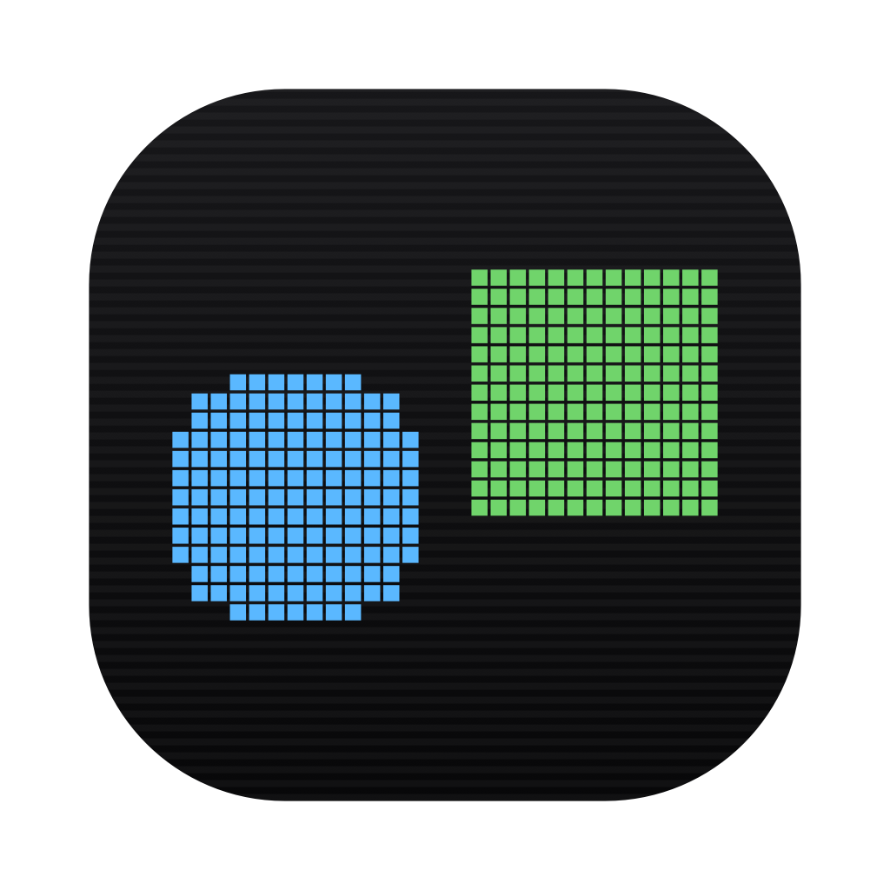

<p align="center">
  
</p>

# VibeBuddy

A native macOS app that turns the MacBook notch into a dashboard for your coding
agents. Swift, SwiftPM, macOS 14 or later, no external dependencies: the standard
library and Apple frameworks, nothing else.

It alerts you when an agent finishes and when it is waiting for an answer, shows
the real 5 h and 7 d usage percentages rather than an estimate, tracks several
sessions at once grouped by project, and answers Claude Code's permission
prompts from the notch. An animated *buddy* carries the state, follows your
pointer and laughs when you poke it.

<p align="center">
  <video
    src="https://raw.githubusercontent.com/funkymed/VibeBuddy/main/docs/video.mp4"
    poster="./docs/video-poster.png"
    width="720" controls muted playsinline></video>
</p>

## 1. Install

```sh
brew install --cask funkymed/vibebuddy/vibebuddy
xattr -dr com.apple.quarantine /Applications/VibeBuddy.app
```

The second line is not optional. Homebrew *adds* the quarantine attribute, and
macOS then refuses the first launch and offers to move the app to the Trash. The
app is signed with a stable self-signed identity but it is not notarised, and
notarisation needs an Apple Developer membership at 99 €/year.

That `xattr` command turns off a protection macOS applied on purpose. It is
written here rather than run silently from a cask postflight, because turning off
someone's protection is their decision to make, not a package's. For a DMG
downloaded by hand, right-click then Open once does the same thing.

The tap is
[`funkymed/homebrew-vibebuddy`](https://github.com/funkymed/homebrew-vibebuddy);
releases are at [`funkymed/VibeBuddy`](https://github.com/funkymed/VibeBuddy/releases).

To remove it, including the buddies, the preferences and the socket:

```sh
brew uninstall --zap --cask vibebuddy
```

## 2. Build and test

```sh
git clone https://github.com/funkymed/VibeBuddy.git && cd VibeBuddy
make run                      # debug build, straight from source
make test                     # 494 tests, 79 suites
```

Signing needs a one-time identity, created in your login keychain and never
stored in the repository. Build it once and `make app` works from then on:

```sh
./scripts/make-identity.sh
make app                      # dist/VibeBuddy.app, universal, signed
```

Two instances fight over the same socket. The second unlinks it and binds its
own, so the first listens on a dead inode while still drawing its pill. Run
`make stop` before starting another.

The tests cover what breaks silently: the transcript parser, the alert state
machine, notch geometry, the `.buddy` format, the context window, terminal
matching, the hook wire format byte for byte, the permission queue's five exits,
and the ordered JSON that keeps `~/.claude/settings.json` in the order its owner
wrote it. What they do not catch is what only a real session shows. Five defects
were found in one evening of driving Claude Code by hand, none of them visible to
the suite. Field-test the thing.

## 3. Make commands

`make` on its own prints this list.

```sh
make app                      # dist/VibeBuddy.app, universal, signed
make dmg                      # dist/VibeBuddy-<version>.dmg
make run                      # debug build, straight from source
make stop                     # kill every instance and unlink the socket
make test                     # 494 tests, 79 suites
make publish version=0.1.0    # sign, package, tag, release
```

Permission interception needs a hook registered in `~/.claude/settings.json`. The
app never writes that file on its own: `make install-hook` shows the exact diff
and waits.

## Documentation

| File | Contents |
|---|---|
| [`CLAUDE.md`](CLAUDE.md) | The rules: product goals, structural decisions, Gantt, conventions |
| [`docs/hook.md`](docs/hook.md) | The state of the code and its traps, including the `.buddy` format and the hook bridge |
| [`docs/rfc/`](docs/rfc/) | One RFC per subject, with its action plan and percentages |
| [`docs/perf/`](docs/perf/) | The measurements, as dated CSVs |

Lightness comes before features. The app is on screen permanently, so every
needless wakeup is paid for in battery life: the budget is under 2 idle wakeups
per second at rest, and wakeup count governs rather than CPU percentage. The
numbers and the reasoning are in `CLAUDE.md`.

## Inspiration

The idea comes from Notch-Pilot: collecting Claude's data, and doing it in Swift.

This is not a fork. Nothing was copied.
